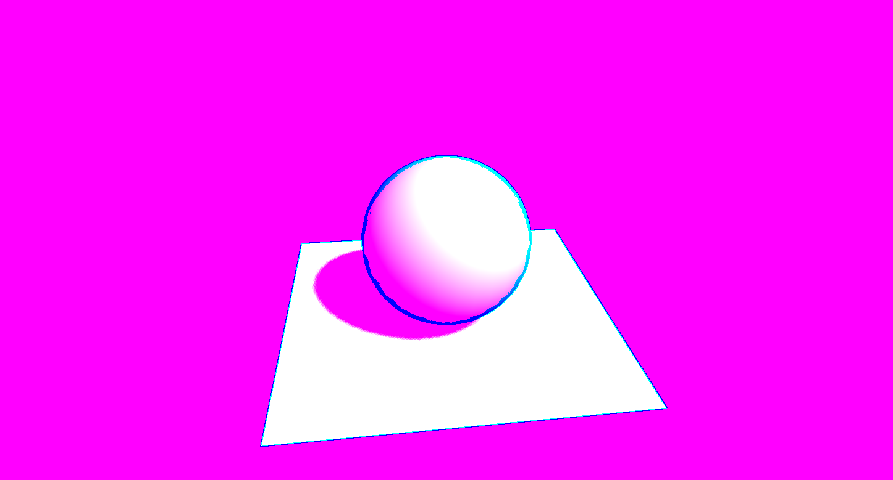

https://kurganpsp.github.io/shadertoy_threejs/


# Por [Markus Neuy](https://medium.com/@markus.neuy) y [Dirk Krause](https://medium.com/@dirkk) #</summary>
Cómo transferir Shaders de Shadertoy a ThreeJS


# Introducción #

Como parte de nuestra investigación en Publicis Pixelpark Innovationlab, estudiamos cómo podríamos usar lenguajes de bajo nivel para tecnologías web. La elección obvia parecía ser [asm.js](http://asmjs.org/) o [WebAssembly](https://webassembly.org/).

Pero también podría usar WebGL Shaders para resolver problemas orientados a la máquina. Los sombreadores se programan en un lenguaje similar a C / C ++, y aunque no están destinados principalmente a resolver problemas genéricos, se pueden usar para más cosas que solo renderizar imágenes y escenas 3D.
Una segunda motivación se deriva de la estética que se puede lograr con los sombreadores. En 2002, un grupo de estudiantes de la Universidad de Wisconsin-Madison publicó [NPRQuake](https://research.cs.wisc.edu/graphics/Gallery/NPRQuake/whatIsIt.html) ("Quake de representación no fotorrealista") , una variación del conocido juego Quake al inyectar código en el flujo de trabajo de renderizado.


Captura de pantalla de NPRQuake

La calidad estética de esta variación fue impresionante; Inmediatamente entendimos que este tipo de efectos podría ser disruptivo en los proyectos. Si bien en 2002 esta variación solo fue posible escribiendo controladores para OpenGL, ahora en 2018 se puede lograr mediante sombreadores, incluso en navegadores web.

Entonces, cuando recientemente estuvimos involucrados en un proyecto de arte, decidimos darle una oportunidad a los sombreadores.

- - - -


# Disponibilidad de ejemplos de Shaders #

Si realmente no está acostumbrado a programar sombreadores, la opción obvia es buscar ejemplos disponibles de forma gratuita y usarlos (con una mirada cuidadosa a las licencias involucradas). Una biblioteca que se destaca a este respecto es [Shadertoy](https://www.shadertoy.com/) con [ShaderFrog](https://shaderfrog.com/) como otro ejemplo.

Como trabajamos con éxito con ThreeJS antes, decidimos publicar nuestros hallazgos con sombreadores de posprocesamiento de Shadertoy en ThreeJS.
- - - -


# Shader en ThreeJS #

ThreeJS puede utilizar sombreadores de posprocesamiento que alteran toda la imagen renderizada y también sombreadores de material, que pueden alterar el material de los objetos 3D. Ambos tipos necesitan un shader de vértices y un shader de fragmento; un shader de vértices puede cambiar la posición de los vértices en 3D, mientras que un shader de fragmentos generalmente reemplaza el color de una imagen renderizada.

Esta imagen muestra las cuatro variaciones posibles.


Tipos de sombreadores

En la esquina superior izquierda, un shader de posprocesamiento agrega un degradado de color a la imagen renderizada. A la derecha, un shader de vértices reduce el área de renderizado. Las dos imágenes inferiores muestran shaders de material; el izquierdo solo altera el color mientras que el derecho cambia la posición de los vértices. Dado que los shaders siempre están compuestos de partes de vértices y fragmentos, el último ejemplo también cambia el color.


- - - -


# Shadertoy #

# Ejemplo trivial de Shadertoy #

Estudiamos cómo transferir un shader de Shadertoy a ThreeJS en 2014 con los primeros resultados publicados en [StackOverflow](https://stackoverflow.com/questions/24820004/how-to-implement-a-shadertoy-shader-in-three-js/37508079#37508079). Encontramos el siguiente patrón útil:


* Agregue [variables específicas de ShaderToy](https://www.shadertoy.com/howto) como **iGlobalTime** etc.

* Cambiar nombre **mainImage (out vec4 z, in vec2 w)** a **main ()**

* Renombrar **z** a **gl_FragColor**


Siguiendo estos patrones, puede transferir [un shader simple a ThreeJS](https://jsfiddle.net/dirkk0/zt9dhvqx/).


Shader trivial


- - - -


# Ejemplo no trivial de Shadertoy

Con un sombreador más complejo, debe hacer mucho más, como describiremos ahora. Para un ejemplo no trivial, elegimos **Noise Contour** de [candycat](https://www.shadertoy.com/user/candycat) ya que tienes un par de problemas con él. Puede encontrarlo aquí: https://www.shadertoy.com/view/MscSzf

Este ejemplo también crea una escena completa en lenguaje shader. Pero en ThreeJS generalmente desea controlar los objetos 3D, por lo que decidimos crear la escena en ThreeJS sin dejar de utilizar los sombreadores para modificarla.


- - - - 


# Comprender la estructura de los shaders

Comenzamos tratando de comprender la estructura del sombreador; Esto se puede lograr con el editor de Shadertoy. Como las ediciones del código se pueden ver en tiempo real, podemos hacer pequeños cambios para comprender cómo funciona.


Debajo del código actual vemos que este código se basa en un canal llamado **iChannel0**, con **B** que indica un búfer.


Para ver este búfer en acción, comentemos la línea 37 y agreguemos esto:

~~shadertoy1_step0_fragColor1.glsl~~
```cpp
// fragColor = mix(EdgeColor, mCol, edge);
fragColor = texture(iChannel0, uv);
```

El resultado debería ser:


Este simple cambio hace que se muestre el color del búfer anterior y no el resultado de este búfer.

Al examinar el búfer anterior, **Buf B**, vemos que este también usa **iChannel0**, por lo que todavía no estamos viendo la escena original creando código.


Utilizando el mismo truco que antes, comentamos la línea 29 y agregamos una línea que calcula los rayos UV y el color actual de la siguiente manera:

```cpp
// shadertoy1_step0_fragColor1.glsl
// fragColor = vec4(edge, sample0.w, 1.0, 1.0);
fragColor = texture(iChannel0, fragCoord / iResolution.xy);
```

Esto debería dejarnos con:


Esto se parece mucho más a una escena normal. Además, **Buf A** no usa otro búfer, por lo que estamos viendo la escena original creando código.


- - - -


# Reconstrucción en ThreeJS

Descargo de responsabilidad completo aquí: lo que sigue es, de ninguna manera, el código "óptimo", sino solo una forma de resolver el problema de la manera más directa.

## Creando la escena

Comenzamos creando una escena algo más simple con solo una esfera y un plano. Además, queremos usar **MeshNormalMaterial** de ThreeJS.

Aquí se muestra un posible resultado:


Shader en ThreeJS paso 0


El código está contenido en un archivo HTML llamado index.html:

```html
    <!--shadertoy1_step1_index.html-->
    <!DOCTYPE html>
    <html lang="en">
    <head>
    <meta charset="UTF-8">
    <meta name="viewport" content="width=device-width, initial-scale=1.0">
    <meta http-equiv="X-UA-Compatible" content="ie=edge">
    <title>ThreeJS Shader Experiment 1 - Step 0</title>
    <style>
        html,
        body {
            height: 100%;
            width: 100%;
            margin: 0;
            padding: 0;
            overflow: hidden;
        }
    </style>
    </head>
    <body>
        <!-- https://raw.githubusercontent.com/mrdoob/three.js/dev/build/three.min.js -->
        <script src="three.min.js"></script>
        <!-- https://raw.githubusercontent.com/mrdoob/three.js/dev/examples/js/controls/OrbitControls.js -->
        <script src="OrbitControls.js"></script>
        <!-- https://raw.githubusercontent.com/mrdoob/three.js/dev/examples/js/shaders/CopyShader.js -->
        <script src="CopyShader.js"></script>
        <!-- https://raw.githubusercontent.com/mrdoob/three.js/dev/examples/js/postprocessing/EffectComposer.js -->
        <script src="EffectComposer.js"></script>
        <!-- https://raw.githubusercontent.com/mrdoob/three.js/dev/examples/js/postprocessing/ShaderPass.js -->
        <script src="ShaderPass.js"></script>
        <!-- https://raw.githubusercontent.com/mrdoob/three.js/dev/examples/js/postprocessing/RenderPass.js -->
        <script src="RenderPass.js"></script>
        <script src="index.js"></script>
    </body>
    </html>
```

Necesitamos ocuparnos de las dependencias de la biblioteca ThreeJS y también agregamos nuestro propio código en index.js:

```js
    //shadertoy1_step1_index.js
    const container = document.body;
    const FOV = 45;
    const NEAR = 0.1;
    const FAR = 1000;
    let height = container.clientHeight;
    let width = container.clientWidth;
    const ASPECT = width / height;

    const renderer = new THREE.WebGLRenderer({ antialias: true });
    renderer.setPixelRatio(window.devicePixelRatio || 1);
    renderer.setClearColor(0x000000);

    const canvas = renderer.domElement;

    const scene = new THREE.Scene();

    const camera = new THREE.PerspectiveCamera(FOV, ASPECT, NEAR, FAR);
    camera.position.set(-2, 2, 2);
    camera.target = new THREE.Vector3(0, 0, 0);

    const controls = new THREE.OrbitControls(camera, canvas);

    const matNormal = new THREE.MeshNormalMaterial();

    const floorGeo = new THREE.PlaneBufferGeometry(2.0, 2.0);
    const floor = new THREE.Mesh(floorGeo, matNormal);
    floor.position.set(0, -0.5, 0);
    floor.rotation.x = -((Math.PI * 90) / 180);

    const sphereGeo = new THREE.SphereBufferGeometry(0.5, 32, 32);
    const sphere = new THREE.Mesh(sphereGeo, matNormal);

    scene.add(floor);
    scene.add(sphere);
    scene.add(camera);

    const resize = (width, height) => {
        camera.aspect = width / height;
        camera.updateProjectionMatrix();

        renderer.setSize(width, height);
};

const render = () => {
    const tmpHeight = container.clientHeight;
    const tmpWidth = container.clientWidth;
    if (tmpHeight !== height || tmpWidth !== width) {
        height = tmpHeight;
        width = tmpWidth;
        resize(width, height);
    }

    controls.update();

    renderer.render(scene, camera);

    requestAnimationFrame(render);
};


container.appendChild(canvas);
resize(width, height);
render();
```

Este código JavaScript crea un renderizador, una cámara, un control de órbita y también el plano y la esfera con un **MeshNormalMaterial**. También se encarga de los cambios de tamaño de la ventana y la representación.

Esto concluye el paso cero de portar la escena de Shadertoy.


Shader en ThreeJS paso 0


## Recreando la primera pasada del shader

En el siguiente paso, tratamos de recrear el primer paso de renderizado del sombreador en el búfer; Esto es básicamente copiar el código del sombreador a ThreeJS.

Este debería ser el resultado:


Shadertoy sin el último pase

Para lograr esto, utilizamos el [EffectComposer](https://github.com/mrdoob/three.js/blob/dev/examples/js/postprocessing/EffectComposer.js) para ThreeJS, que proporciona una forma sencilla de usar sombreadores de posprocesamiento .

```js
    // shadertoy1_step2_effect_composer_index.js
    scene.add(sphere);
    scene.add(camera);

    const drawShader = {
    uniforms: {
    tDiffuse: { type: 't', value: null },
    },
    vertexShader: VERTEX,
    fragmentShader: FRAGMENT,
    };

    const composer = new THREE.EffectComposer(renderer);
    composer.addPass(new THREE.RenderPass(scene, camera));

    const pass = new THREE.ShaderPass(drawShader);
    pass.renderToScreen = true;
    composer.addPass(pass);


    const resize = (width, height) => {
        camera.aspect = width / height;
    // ...
```

Esto crea una instancia de EffectComposer que agrega un pase de renderizado normal y un pase de sombreador adicional. Copiamos el código del sombreador en las variables **VERTEX** y **FRAGMENT**. La definición del sombreador también define un **Uniforme** llamado **tDiffuse** utilizado por el EffectComposer. Contiene la imagen del pase de representación anterior que se alterará en el pase actual.

Con este nuevo paso de render en acción, mostramos este pase en lugar de la escena original. Por lo tanto, necesitamos agregar algo de código para cambiar el tamaño, por lo tanto, agregamos:

```js
    //shadertoy1_step2_resize_index.js
    const resize = (width, height) => {
    camera.aspect = width / height;
    camera.updateProjectionMatrix();

    composer.setSize(width, height);

    renderer.setSize(width, height);
    };


    const render = () => {
    const tmpHeight = container.clientHeight;
    const tmpWidth = container.clientWidth;
    if (tmpHeight !== height || tmpWidth !== width) {
    height = tmpHeight;
    width = tmpWidth;
    resize(width, height);
    }

    controls.update();

    // renderer.render(scene, camera);
    composer.render();

    requestAnimationFrame(render);
    };
```

Now we need to define the constants **VERTEX** und **FRAGMENT**. We can’t use Shadertoy’s vertex shader, so we need to define our own:
Ahora necesitamos definir las constantes **VERTEX** y **FRAGMENT**. No podemos usar el shader de vértices de Shadertoy, por lo que debemos definir el nuestro:

```js
    //shadertoy1_step2_vertex.js
    const VERTEX = `
    varying vec2 vUv;
    void main() {
        vec4 mvPosition = modelViewMatrix * vec4(position, 1.);
        gl_Position = projectionMatrix * mvPosition;
        vUv = uv;
    }
    `;
```

Sin embargo, utilizamos el shader de fragmentos de Shadertoy y lo agregamos a **FRAGMENT**:

```js
    //shadertoy1_step2_fragment.js
    const FRAGMENT = `
    // Edge detection Pass
    #define Sensitivity (vec2(0.3, 1.5) * iResolution.y / 400.0)
    float checkSame(vec4 center, vec4 samplef)
    {
        vec2 centerNormal = center.xy;
        float centerDepth = center.z;
        vec2 sampleNormal = samplef.xy;
        float sampleDepth = samplef.z;
        vec2 diffNormal = abs(centerNormal - sampleNormal) * Sensitivity.x;
        bool isSameNormal = (diffNormal.x + diffNormal.y) < 0.1;
        float diffDepth = abs(centerDepth - sampleDepth) * Sensitivity.y;
        bool isSameDepth = diffDepth < 0.1;
        return (isSameNormal && isSameDepth) ? 1.0 : 0.0;
    }
    void mainImage( out vec4 fragColor, in vec2 fragCoord )
    {
        vec4 sample0 = texture(iChannel0, fragCoord / iResolution.xy);
        vec4 sample1 = texture(iChannel0, (fragCoord + vec2(1.0, 1.0)) / iResolution.xy);
        vec4 sample2 = texture(iChannel0, (fragCoord + vec2(-1.0, -1.0)) / iResolution.xy);
        vec4 sample3 = texture(iChannel0, (fragCoord + vec2(-1.0, 1.0)) / iResolution.xy);
        vec4 sample4 = texture(iChannel0, (fragCoord + vec2(1.0, -1.0)) / iResolution.xy);
        float edge = checkSame(sample1, sample2) * checkSame(sample3, sample4);
        fragColor = vec4(edge, sample0.w, 1.0, 1.0);
    }
    `;
```

Básicamente, esto crea el sombreador, pero aún debemos abordar los siguientes problemas:

* la coordenada del shader de vértices todavía no se usa en el shader de fragmentos
* el shader de fragmentos usa una textura desconocida en el contexto actual de WebGL
* **mainImage** debe cambiarse de nombre a **main**
* **iResolution** aún no está configurado.

Entonces, el shader aún no funciona.

Abordar el primer problema da como resultado esta definición:


```js
    //shadertoy1_step2_fragment2.js
    const FRAGMENT = `
    // Edge detection Pass
    varying vec2 vUv;
    // ...
```

Ahora podemos usar el vector **vUv** en lugar de **fragCoord / iResolution.xy**. Esto resulta en:

```js
    // shadertoy1_step2_fragment3.glsl
    void mainImage( out vec4 fragColor, in vec2 fragCoord )
    {
    vec4 sample0 = texture(tDiffuse, vUv);
    vec4 sample1 = texture(tDiffuse, vUv + (vec2(1.0, 1.0) / iResolution.xy));
    vec4 sample2 = texture(tDiffuse, vUv + (vec2(-1.0, -1.0) / iResolution.xy));
    vec4 sample3 = texture(tDiffuse, vUv + (vec2(-1.0, 1.0) / iResolution.xy));
    vec4 sample4 = texture(tDiffuse, vUv + (vec2(1.0, -1.0) / iResolution.xy));
    // ...
```

Ahora simplemente reemplazamos cada ocurrencia de **textura** con **texture2D**.

Además, modificamos **mainImage** a **main** sin parámetros:

```js
    //shadertoy1_step2_fragment4.glsl
    // void mainImage( out vec4 fragColor, in vec2 fragCoord ) {

    void main () {
    // ...
```

**main** should also return **gl_FragColor** instead of **fragColor** which defines the color in the shader.
**main** también debería retornar **gl_FragColor** en lugar de **fragColor** que define el color en el shader.

```js
    //shadertoy1_step2_fragment5.glsl
    void main () {
    // ...
    gl_FragColor = vec4(edge, sample0.w, 1.0, 1.0);
    }
```

Por último, necesitamos establecer **iResolution** agregándolo a los uniforms. Hacemos esto definiendo un vector ThreeJS que almacena el ancho y la altura:

```js
    //shadertoy1_step2_resolution_index.js
    const resolution = new THREE.Vector2(width, height);
```

Ahora podemos agregar la resolución a los uniforms:

```js
    //shadertoy1_step2_shader_index.js
    const drawShader = {
        uniforms: {
            tDiffuse: { type: 't', value: null },
            iResolution: { type: 'v2', value: resolution },
        },
        vertexShader: VERTEX,
        fragmentShader: FRAGMENT,
    };
```

Necesitamos mejorar nuestra función **resize**:

Es importante que usemos los uniformes del pase de renderizado real. El original ha sido profundamente clonado por el EffectComposer; cambiar la variable **resolution** no tendría ningún efecto.

Como definimos dos uniformes, necesitamos presentarles nuestros shader de fragmentos para que los definamos:

```js
    //shadertoy1_step2_fragment6_index.js
    const FRAGMENT = `
    uniform sampler2D tDiffuse;
    uniform vec2 iResolution;
    // ...
```

Esto concluye este pase de shader y si todo salió bien, vemos esto:


Pase de shader 1 sin sombras


De las líneas azules vemos que generalmente funciona, pero aún falta la parte rosa. Cambiemos eso.


## Resolver el problema con sombras

Falta la parte rosa ya que el shader en Shadertoy representa en secreto las sombras en un canal alfa que no era visible en primer lugar, como podemos ver en la siguiente imagen:


Shadows in Shadertoy


Hay varias formas de resolver esto - utilizamos la sencilla agregando un material que contenga las sombras. Estos deben manejarse en un pase de renderizado adicional.


Así que creemos sombras en ThreeJS:

```js
    // shadertoy1_step3_shadow1_index.js
    renderer.shadowMap.enabled = true;
    renderer.shadowMap.renderReverseSided = false;

    // ...
    floor.receiveShadow = true;

    // ...
    sphere.castShadow = true;
    sphere.receiveShadow = true;
```

Las sombras necesitan luz, en este caso direccional:


```js
    //shadertoy1_step3_shadow2_index.js
    const SHADOW_MAP_SIZE = 1024;

    const directionalLight = new THREE.DirectionalLight( 0xffffff, 1.5 );
    directionalLight.position.set( -1, 1.75, 1 );
    directionalLight.castShadow = true;
    directionalLight.shadow.mapSize.width = SHADOW_MAP_SIZE;
    directionalLight.shadow.mapSize.height = SHADOW_MAP_SIZE;
    directionalLight.shadow.camera.far = 3500;
    directionalLight.shadow.bias = -0.0001;

    scene.add(directionalLight);
```

Un **MeshPhongMaterial** puede contener sombras.


```js
    //shadertoy1_step3_material_index.js
    const matShadow = new THREE.MeshPhongMaterial({
        color: 0xffffff,
        shininess: 0.0,
    });
```

Mientras que un nuevo objetivo de renderizado los salva.


```js
    //shadertoy1_step3_target_index.js
    const PARAMETERS = {
        minFilter: THREE.LinearFilter,
        magFilter: THREE.LinearFilter,
        format: THREE.RGBFormat,
        stencilBuffer: false
    };

    const shadowBuffer = new THREE.WebGLRenderTarget(1, 1, PARAMETERS);
```

Y de nuevo, se necesita una función **resize**:


```js
    //shadertoy1_step3_resize_index.js
    shadowBuffer.setSize(width, height);
```

Ahora podemos transferir las sombras al nuevo objetivo de renderizado y prepararlo para el shader:


```js
    //shadertoy1_step3_render_index.js
    const render () => {
        const tmpHeight = container.clientHeight;
        const tmpWidth = container.clientWidth;
        if (tmpHeight !== height || tmpWidth !== width) {
            height = tmpHeight;
            width = tmpWidth;
            resize(width, height);
        }
        controls.update();

        floor.material = matShadow;
        sphere.material = matShadow;
        renderer.render(scene, camera, shadowBuffer);
        pass.uniforms.tShadow.value = shadowBuffer.texture;

        floor.material = matNormal;
        sphere.material = matNormal;

        composer.render();

        requestAnimationFrame(render);
    }
```

Estas líneas establecen el material, renderizan la escena, establecen la sombra en un uniform y cambian el material nuevamente a **MeshNormalMaterial**.

Ahora el sombreador necesita saber acerca de las sombras para poder procesarlas, así que cambiamos los uniforms:

```js
    //shadertoy1_step3_shader_index.js
    const drawShader = {
        uniforms: {
            tDiffuse: { type: 't', value: null },
            tShadow: { type: 't', value: null },
            iResolution: { type: 'v2', value: resolution },
        },
        vertexShader: VERTEX,
        fragmentShader: FRAGMENT,
    };
```

Lo mismo para el shader de fragmento:

```js
    //shadertoy1_step3_fragment_index.js
    const FRAGMENT = `
    uniform sampler2D tDiffuse;
    uniform sampler2D tShadow;
    uniform vec2 iResolution;
    varying vec2 vUv;
    //...
```

Luego reemplazamos la línea anterior con nuestra sombra.

```js
    //shadertoy1_step3_fragment2.glsl
    // gl_FragColor = vec4(edge, sample0.w, 1.0, 1.0);
    float shadow = texture2D(tShadow, vUv).x;
    gl_FragColor = vec4(edge, shadow, 1.0, 1.0);
```

El resultado debería parecerse al segundo paso en Shadertoy.



Shader paso 1


Ahora solo nos falta el segundo pase de shader para completar esto.


## El pase final del shader

Para la pasada final del sombreador, agregamos otra instancia de EffectComposer.
Definamos otro shader:

```js
    //shadertoy1_step4_shader_index.js
    const FRAGMENT_FINAL = `
    #define EdgeColor vec4(0.2, 0.2, 0.15, 1.0)
    #define BackgroundColor vec4(1,0.95,0.85,1)
    #define NoiseAmount 0.01
    #define ErrorPeriod 30.0
    #define ErrorRange 0.003
    // Reference: https://www.shadertoy.com/view/MsSGD1
    float triangle(float x)
    {
        return abs(1.0 - mod(abs(x), 2.0)) * 2.0 - 1.0;
    }
    float rand(float x)
    {
        return fract(sin(x) * 43758.5453);
    }
    void mainImage( out vec4 fragColor, in vec2 fragCoord )
    {
        float time = floor(iTime * 16.0) / 16.0;
        vec2 uv = fragCoord.xy / iResolution.xy;
        uv += vec2(triangle(uv.y * rand(time) * 1.0) * rand(time * 1.9) * 0.005,
        triangle(uv.x * rand(time * 3.4) * 1.0) * rand(time * 2.1) * 0.005);
        float noise = (texture(iChannel1, uv * 0.5).r - 0.5) * NoiseAmount;
        vec2 uvs[3];
        uvs[0] = uv + vec2(ErrorRange * sin(ErrorPeriod * uv.y + 0.0) + noise, ErrorRange * sin(ErrorPeriod * uv.x + 0.0) + noise);
        uvs[1] = uv + vec2(ErrorRange * sin(ErrorPeriod * uv.y + 1.047) + noise, ErrorRange * sin(ErrorPeriod * uv.x + 3.142) + noise);
        uvs[2] = uv + vec2(ErrorRange * sin(ErrorPeriod * uv.y + 2.094) + noise, ErrorRange * sin(ErrorPeriod * uv.x + 1.571) + noise);
        float edge = texture(iChannel0, uvs[0]).r * texture(iChannel0, uvs[1]).r * texture(iChannel0, uvs[2]).r;
        float diffuse = texture(iChannel0, uv).g;
        float w = fwidth(diffuse) * 2.0;
        vec4 mCol = mix(BackgroundColor * 0.5, BackgroundColor, mix(0.0, 1.0, smoothstep(-w, w, diffuse - 0.3)));
        fragColor = mix(EdgeColor, mCol, edge);
        fragColor = texture(iChannel0, uv);
        //fragColor = vec4(diffuse);
    }`;

    const finalShader = {
        uniforms: {
            tDiffuse: { type: 't', value: null},
        },
        vertexShader: VERTEX,
        fragmentShader: FRAGMENT_FINAL
    };

    const passFinal = new THREE.ShaderPass(finalShader);
    passFinal.renderToScreen = true;
    composer.addPass(passFinal);
```

Desactivamos **renderToScreen** para el pase de renderizado anterior:

```js
    //shadertoy1_step4_shader2_index.js
    const pass = new THREE.ShaderPass(drawShader);
    // REMOVED FOR FINAL SHADER pass.renderToScreen = true;
    composer.addPass(pass);
```

Nuevamente, se introducen más variables; **iTime** para cambiar las variables con el tiempo y **iChannel1** para agregar ruido.


Shadertoy Ruido y iTime


Utilizamos un reloj ThreeJS para **iTime**.

```js
    //shadertoy1_step4_clock_index.js
    const clock = new THREE.Clock();
```

Con cada cambio también actualizamos **iTime**:

```js
    //shadertoy1_step4_render_index.js
    const render () => {
    // ...
    const elapsed = clock.getElapsedTime();
    passFinal.uniforms.iTime.value = elapsed;

    composer.render();

    // ....
    }
```

Agregamos **iTime** y ruido a los uniforme:

```js
    //shadertoy1_step4_shader3_index.js
    const finalShader = {
        uniforms: {
            tDiffuse: { type: 't', value: null},
            iTime: { type: 'f', value: 0.0},
            tNoise: { type: 't', value: new THREE.TextureLoader().load('noise.png')}
        },
        vertexShader: VERTEX,
        fragmentShader: FRAGMENT_FINAL
    };
```

El ruido es simplemente una textura ruidosa (por ejemplo, la de Shadertoy) que cargamos con ThreeJS en **tNoise**.

Ahora tenemos que adaptar el shader de fragmentos a nuestras nuevas variables, por lo que aplicamos las siguientes medidas:

* cambiar **mainImage** a **main**
* definir uniforms y adaptar las variables
* define las coordenadas **vUv**
* cambie el resultado devuelto a **gl_FragColor**
* reemplazar **textura** con **textura2D**

Esto nos da:

```js
    //shadertoy1_step4_fragment_index.js
    const FRAGMENT_FINAL = `
    uniform sampler2D tDiffuse;
    uniform sampler2D tNoise;
    uniform float iTime;
    varying vec2 vUv;
    #define EdgeColor vec4(0.2, 0.2, 0.15, 1.0)
    #define BackgroundColor vec4(1,0.95,0.85,1)
    #define NoiseAmount 0.01
    #define ErrorPeriod 30.0
    #define ErrorRange 0.003
    // Reference: https://www.shadertoy.com/view/MsSGD1
    float triangle(float x)
    {
        return abs(1.0 - mod(abs(x), 2.0)) * 2.0 - 1.0;
    }
    float rand(float x)
    {
        return fract(sin(x) * 43758.5453);
    }
    void main()
    {
        float time = floor(iTime * 16.0) / 16.0;
        vec2 uv = vUv;
        uv += vec2(triangle(uv.y * rand(time) * 1.0) * rand(time * 1.9) * 0.005,
        triangle(uv.x * rand(time * 3.4) * 1.0) * rand(time * 2.1) * 0.005);
        float noise = (texture2D(tNoise, uv * 0.5).r - 0.5) * NoiseAmount;
        vec2 uvs[3];
        uvs[0] = uv + vec2(ErrorRange * sin(ErrorPeriod * uv.y + 0.0) + noise, ErrorRange * sin(ErrorPeriod * uv.x + 0.0) + noise);
        uvs[1] = uv + vec2(ErrorRange * sin(ErrorPeriod * uv.y + 1.047) + noise, ErrorRange * sin(ErrorPeriod * uv.x + 3.142) + noise);
        uvs[2] = uv + vec2(ErrorRange * sin(ErrorPeriod * uv.y + 2.094) + noise, ErrorRange * sin(ErrorPeriod * uv.x + 1.571) + noise);
        float edge = texture2D(tDiffuse, uvs[0]).r * texture2D(tDiffuse, uvs[1]).r * texture2D(tDiffuse, uvs[2]).r;
        float diffuse = texture2D(tDiffuse, uv).g;
        float w = fwidth(diffuse) * 2.0;
        vec4 mCol = mix(BackgroundColor * 0.5, BackgroundColor, mix(0.0, 1.0, smoothstep(-w, w, diffuse - 0.3)));
        gl_FragColor = mix(EdgeColor, mCol, edge);
    }
    `;
```

Después de estos cambios, el sjader aún no se compilará, porque este sombreador necesita una extensión WebGL específica. Afortunadamente, esto es fácil de agregar en ThreeJS:

```js
    //shadertoy1_step4_derivates_index.js
    const passFinal = new THREE.ShaderPass(finalShader);
    passFinal.renderToScreen = true;
    passFinal.material.extensions.derivatives = true;
    composer.addPass(passFinal);
```

Esto nos da el siguiente resultado:


Shader Final


Lo cual está muy cerca del Shadertoy original:


Shader Final


- - - -


# Conclusión

Hemos transferido con éxito un sombreador Shadertoy complejo a ThreeJS siguiendo estos pasos:

* entender la estructura del sombreador específico
* implementar pases de sombreador
* abordar posibles incompatibilidades GLSL
* crear pases shader opcionales y/o materiales 
* activar extensiones opcionales

Esperamos que estos desafíos se mitiguen con el próximo soporte WebGL2 en ThreeJS ya que las posibles incompatibilidades GLSL deberían desaparecer.

El código fuente completo esta [aquí](https://github.com/dirkk0/Shadertoy2Threejs).


El resultado final


- - - -


# Enlaces y recursos útiles

* [Version Shadertoy](https://www.shadertoy.com/view/MscSzf)
* [WebGL2Fundamentals](https://webgl2fundamentals.org)
* [ThreeJS](https://threejs.org/)
* [ThreeJS Ejemplos](https://github.com/mrdoob/three.js/tree/dev/examples)
* [Extensiones-WebGL](https://developer.mozilla.org/en-US/docs/Web/API/WebGLRenderingContext/getExtension) and (https://github.com/mrdoob/three.js/issues/7379)
* [EffectComposer](https://github.com/hughsk/three-effectcomposer)
* [Otro enfoque de EffectComposer](https://github.com/spite/Wagner)
* [Tarjeta de referencia rápida de WebGL](https://www.khronos.org/files/webgl/webgl-reference-card-1_0.pdf)


- - - -


# Créditos

Parte de esta investigación fue financiada por [EFRE.NRW Projekt ‘ForK - Forschungsimpulse für die Kreativwirtschaft’](https://lab.publicispixelpark.de/fork/)


- - - -


# Shadertoy2Threejs


Example source code for this Medium article:
[deutsche Version](https://medium.com/@markus.neuy/postprocessing-shader-mit-shadertoy-und-threejs-8164600c6c76) / [english version](https://medium.com/@dirkk/converting-shaders-from-shadertoy-to-threejs-fe17480ed5c6)
